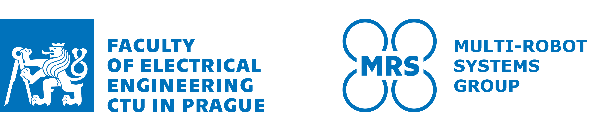

<div align="center">
    <h2>LoL-NMPC: Low-Level Dynamics Integration in Nonlinear Model Predictive Control for Unmanned Aerial Vehicles</h2>
    <br>
        <a href="https://mrs.fel.cvut.cz/members/phdstudents/parakh-gupta" target="_blank">Parakh M. Gupta</a>,
        <a href="https://mrs.fel.cvut.cz/members/phdstudents/ondrej-prochazka" target="_blank">Ondřej Procházka</a>,
        <a href="" target="_blank">Jan Hřebec</a>,
        <a href="https://mrs.fel.cvut.cz/members/phdstudents/matej-novosad" target="_blank">Matej Novosad</a>,
        <a href="https://mrs.fel.cvut.cz/members/professors/penicka" target="_blank">Robert Pěnička</a>, and
        <a href="https://mrs.fel.cvut.cz/members/martin-saska" target="_blank">Martin Saska</a>
        <p>
            <h48>
                <br>
               
                <br>
            </h8>
        </p>
        <a href='https://www.science.org/doi/10.1126/scirobotics.ado6187'></a>
        <a href='https://www.youtube.com/watch?v=jjcKYbYfsqg'></a>
    <br>
    <br>
</div>


This repository contains the open-source implementation of our paper titled 'LoL-NMPC: Low-Level Dynamics Integration in Nonlinear Model Predictive Control for Unmanned Aerial Vehicles', presented at IROS 2025.

## Installation and Usage

### Native Ubuntu 20.04 with ROS1 Noetic

If you have ROS1 installed natively, you should:   

- first install `mrs-uav-system` from [here](https://github.com/ctu-mrs/mrs_uav_system), and then come back here, and then follow next step here.
- Then, you can follow the instruction from the `installation/native_ubuntu-20.04/README.md` folder of this repository, and then follow next step here.
- Then, you should also clone and build our custom `px4_firmware` with the branch `integral_publishing` from [here](https://github.com/ctu-mrs/px4_firmware) into your workspace.
  - If you have build errors, do `pip install toml jsonschema future`.


### Ubuntu 24.04 with ROS1 Noetic in MRS Apptainer

The following guide assumes that you do not have native ROS1 packages and you have a newer Linux (probably Ubuntu 24.04) installed.  

- You should first install [MRS Apptainer](https://github.com/ctu-mrs/mrs_apptainer) by following the instructions in its README, and then follow next step here.
- Then, you should follow the instruction from the `installation/mrs_apptainer/README.md` folder of this repository, and then follow next step here.
- Then, you should also clone and build our custom `px4_firmware` with the branch `integral_publishing` from [here](https://github.com/ctu-mrs/px4_firmware) into your workspace.
  - If you have build errors, do `pip install toml jsonschema future`.  
  
**Please write to us if you face any issues.**

### How to run the simulation

After following the installation steps, you can run the simulation by following these steps:  

- Source your workspace:

  ```bash
  source ~/catkin_ws/devel/setup.bash
  ```

- Launch the simulation by calling `start.sh` at `packages/a300_gazebo_resources/tmux/gazebo_sim/start.sh`.  

## Paper and Citation

You can read our paper at:

[DOI](https://doi.org/10.1109/IROS60139.2025.11246583)  
[Arxiv](https://arxiv.org/abs/2506.02169)  

You can also watch our video presentation at:  

[YouTube](https://www.youtube.com/watch?v=jjcKYbYfsqg)

If you use this work in your research to build on it, or for comparison, or if you find it useful, please consider citing the following paper:

``` bibtex
@INPROCEEDINGS{11246583,
  author={Gupta, Parakh M. and Procházka, Ondřej and Hřebec, Jan and Novosad, Matej and Pěnička, Robert and Saska, Martin},
  booktitle={2025 IEEE/RSJ International Conference on Intelligent Robots and Systems (IROS)}, 
  title={LoL-NMPC: Low-Level Dynamics Integration in Nonlinear Model Predictive Control for Unmanned Aerial Vehicles}, 
  year={2025},
  volume={},
  number={},
  pages={1186-1193},
  keywords={Actuators;Trajectory tracking;Performance gain;Autonomous aerial vehicles;Robustness;Real-time systems;Trajectory;Vehicle dynamics;Standards;Testing},
  doi={10.1109/IROS60139.2025.11246583}}
```

## Contact

For any questions, issues, or help, please either contact [Parakh M. Gupta](http://mrs.fel.cvut.cz/members/phdstudents/parakh-gupta) or [Ondřej Procházka](http://mrs.fel.cvut.cz/members/phdstudents/ondrej-prochazka).
